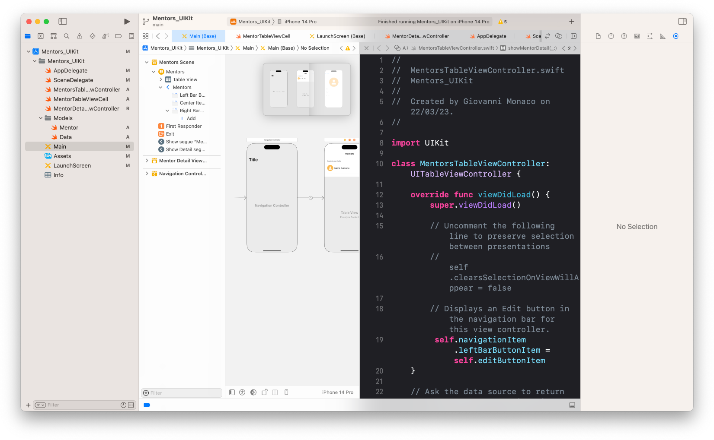

<div align="center">
  <h3>Workshop</h3>
  <h1>Developing Apps with UIKit - Mentors App</h1>
  <br />
    <a href="https://github.com/developer-academy-unina/Workshop-Developing-Apps-with-UIKit/issues/new?assignees=&labels=bug&template=01_BUG_REPORT.md&title=bug%3A+">Report a Bug</a>
  ·
  <a href="https://github.com/developer-academy-unina/Workshop-Developing-Apps-with-UIKit/discussions">Ask a Question</a>
  
</div>
  <br />
<p align="center">
  <a href="#" alt="Version">
    
  </a>
  <a href="#" alt="XCode Version">
    
  </a>        
  <a href="#" alt="Swift Version">
    
  </a>
  <a href="#" alt="Framework used">
    
  </a>          
</p>

<details open="open">
<summary>Table of Contents</summary>

- [About](#about)
- [Getting Started](#getting-started)
  - [Installation](#installation)
  - [How to](#how-to)
- [Issues and Discussions](#issues-and-discussions)
- [Support](#support)
- [Authors & contributors](#authors--contributors)
- [License](#license)

</details>

---
<br />

## About

The Mentors App is a simple application developed using UIKit. It displays information about mentors and allows users to add new ones by tapping the "+" button on the Navigation Bar and completing the form.
The project's goal is to showcase basic UIKit elements and concepts:

- MVC design pattern

- Storyboards

- UILabels, UITextfields, UIButtons

- UITableViewControllers, UITableViews, UITableViewCells

- NavigationControllers

- Segues

- @IBOutlets

- AutoLayout

By exploring the project, you can learn how to create a simple storyboard App.

## Screenshots

<br>

|                               Mentors App                               |                                  Xcode                                          |
| :-------------------------------------------------------------------: | :--------------------------------------------------------------------: |
|  |  |

<br />

## Getting Started

### Installation

1. Clone the repo

   ```sh
   git clone https://github.com/developer-academy-unina/Workshop-Developing-Apps-with-UIKit
   ```

2. Open the ```.xcodeproj``` file

### How to

1. Explore the `Mentors Appp` project files

2. Run the app(⌘+R) and test it

3. Once you have a good understanding of the concepts used in the project, try implementing the same views using different components. For example, you could use a CollectionView instead of the TableView.

Remember to use the MVC design pattern to separate your app's logic and use AutoLayout to ensure that your views look great on different devices and orientations. Good luck with your exploration and implementation!

<br />

## Issues and Discussions

You've found a bug in the source code, a mistake in the documentation or maybe you'd like a new feature? Take a look at [GitHub Discussions](https://github.com/developer-academy-unina/Workshop-Developing-Apps-with-UIKit/discussions) to see if it's already being discussed. You can help us by [submitting an issue on GitHub](https://github.com/developer-academy-unina/Workshop-Developing-Apps-with-UIKit/issues). Before you create an issue, make sure to search the issue archive -- your issue may have already been addressed!

Please try to create bug reports that are:

- _Reproducible._ Include steps to reproduce the problem.
- _Specific._ Include as much detail as possible: which version, what environment, etc.
- _Unique._ Do not duplicate existing opened issues.
- _Scoped to a Single Bug._ One bug per report.

<br />

## Support

Reach out to the maintainer at one of the following places:

- [GitHub Discussions](https://github.com/developer-academy-unina/Workshop-Developing-Apps-with-UIKit/discussions)
- [GitHub issues](https://github.com/developer-academy-unina/Workshop-Developing-Apps-with-UIKit/issues/new?assignees=&labels=question&template=04_SUPPORT_QUESTION.md&title=support%3A+)
- Contact a Mentor for any other help

<br />

## Authors & contributors

The original setup of this repository is by [Giovanni Monaco](https://github.com/giovannimonaco).

For a full list of all authors and contributors, see [the contributors page](https://github.com/developer-academy-unina/Workshop-Developing-Apps-with-UIKit/contributors).

<br />

## License

This project is licensed under the **MIT License**.

See [LICENSE](LICENSE) for more information.
